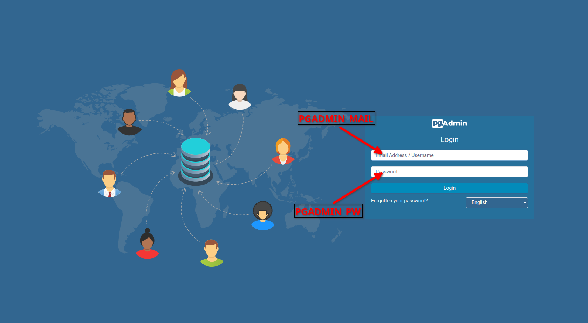
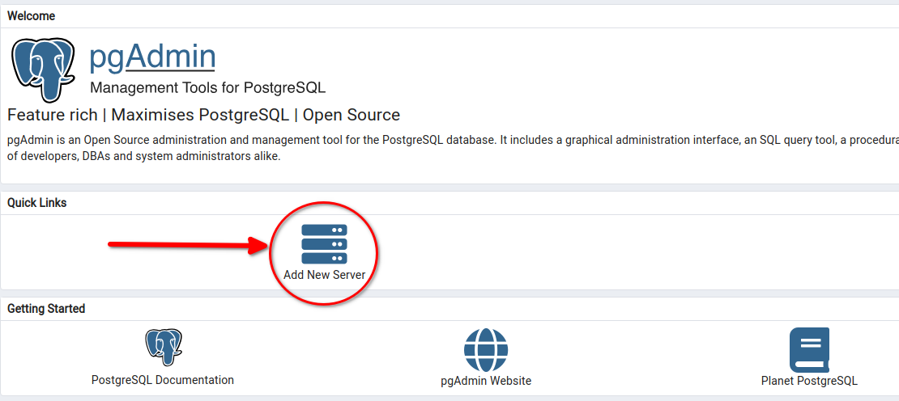
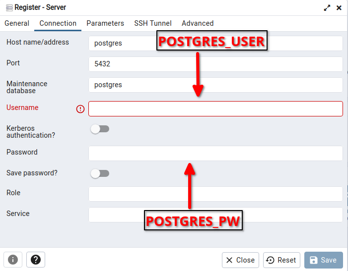

# Docker

Saadaksesi Dockerin käyttöön, tulee docker asentaa koneellesi.

Docker asennusohjeet:
<https://docs.docker.com/get-docker/>

Windows asennustutoriaali:
<https://www.youtube.com/watch?v=rATNU0Fr8zs>

## Luonti ja ajo

Ensiksi tulee luoda postges Docker-image, jolla on suomalaiset merkistöt käytössä. Tämän luomiseksi aja alla oleva komento tässä hakemistossa.
(Huom. piste komennon perässä on tarpeellinen!)

```docker
docker build -t postgres-14-fi:latest .
```

Tämän lisäksi tulee luoda Docker-image node palvelimelle, joka käyttää luotua postgres-tietokantaa. Tämän luomiseksi seuraa server-kansion README.md tiedostossa olevia ohjeita Build-osiossa.

Seuraava komento rakentaa docker kompoosin, joka sisältää sekä juuri luodun posgres-tietokannan että pgAdminin web-palvelimen. Luodakseen kompoosin, tulee kansiossa olla `.env`-tiedosto, jossa on määritelty seuraavat muuttujat

* POSTGRES_USER
* POSTGRES_PW
* POSTGRES_DB
* PGADMIN_MAIL
* PGADMIN_PW

Komento myös ajaa `init`-kansiossa olevan SQL-skriptin, joka luo sovelluksen tietokanta-käyttäjän sekä ajaa skeeman ja testi datan POSTGRES_DB muuttujan tietokantaan.

```docker
docker-compose up -d
```

Jos olet tehnyt muutoksia

## pgAdmin

Kun docker kompoosi on ajossa, voit käyttää pgAdminia selaimeltasi osoitteessa <http://localhost:5050>. Kirjautumiseen tarvittavat tunnukset ovat `.env`-tiedostossa määritellyt PGADMIN_MAIL ja PGADMIN_PW muuttujat.



Kirjauduttuasi sisälle, tulee pgAdmin yhdistää luotuun postgres-tietokantaan `Add New Server`-valikosta.



Nimeä yhteys haluamallasi tavalla `General`-välilehdellä, jonka jälkeen siirry `Connection`-välilehdelle määrittelemään yhteys asetukset.

Täytä seuraavat kentät:

* `Host name/address`: oletusarvona `postgres`, mikäli muokkaat `compose.yaml`-tiedostossa postgres komponentin nimeä, tulee se kirjata tähän
* `Port`: oletusarvo `5432`, mikäli muokkaat `compose.yaml`-tiedostossa portti asetuksia, tulee se kirjata tähän
* `Username`: `POSTGRES_USER`-muuttujan arvo
* `Password`: `POSTGRES_PW`-muuttujan arvo

Lopuksi paina `Save`-painiketta tallentaaksesi yhteyden.


